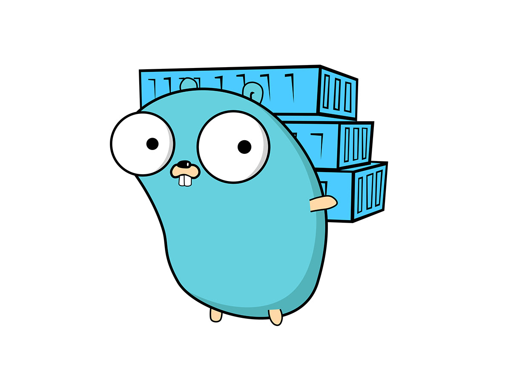

# 设计模式（Golang实现）

## ✨ 创建型模式 ✨

| 模式 | 描述 | 状态 |
| -- | -- | -- |
| 单例模式（Singleton） | 确保类只有一个实例，提供全局访问点，适用于配置管理等场景。 | ✅ |
| 简单工厂（Simple Factory）不是设计模式 | 工厂类根据参数创建对象，集中管理创建逻辑，但扩展性较差。 | ✅ |
| 工厂方法模式（Factory Method） | 定义创建接口，子类实现对象创建，解耦创建与使用，易扩展。 | ✅ |
| 抽象工厂模式（Abstract Factory） | 创建一组相关对象接口，统一产品族，适合跨平台组件场景。 | ✅ |
| 原型模式（Prototype） | 通过复制已有对象创建新对象，适合复杂对象创建或需要克隆的场景。 |  |
| 建造者模式（Builder） | 分步构建复杂对象，分离构造与表示，适合定制化对象创建场景。 |  |

## ✨ 结构型模式 ✨

| 模式 | 描述 | 状态 |
| -- | -- | -- |
| 代理模式（Proxy） | 通过代理对象控制目标对象访问，增强功能或延迟加载，适合权限控制等场景。 |  |
| 适配器模式（Adapter） | 将不兼容的接口转换为目标接口，解决接口不匹配问题，适合系统集成或旧代码复用场景。 |  |
| 装饰者模式（Decorator） | 动态为对象添加额外职责，保持接口一致，适合功能扩展而无需修改原类，常见于流处理或UI组件场景。 |  |
| 桥接模式（Bridge） | 将抽象与实现分离，使两者可独立变化，适合处理多维度变化的场景，如设备驱动或图形渲染。 |  |
| 组合模式（Composite） | 将对象组织成树形结构，统一处理单个对象和组合对象，适合层级结构场景，如文件系统或UI组件树。 |  |
| 外观模式（Facade） | 为复杂子系统提供简化的统一接口，降低使用复杂度，适合封装子系统交互。 |  |
| 享元模式（Flyweight） | 通过共享对象减少内存使用，适合大量相似对象的场景，如文本编辑器中的字符管理。 |  |

## ✨ 行为型模式 ✨

| 模式 | 描述 | 状态 |
| -- | -- | -- |
| 责任链模式（Chain of Responsibility） | 请求沿处理链传递，直到被处理，适合职责分派或过滤器场景。 |  |
| 命令模式（Command） | 将请求封装为对象，支持撤销、重做，适合操作队列或日志记录场景。 |  |
| 迭代器模式（Iterator） | 提供顺序访问集合元素的方式，隐藏内部结构，适合遍历复杂数据结构。 |  |
| 中介者模式（Mediator） | 通过中介对象协调多个对象交互，降低耦合，适合复杂交互场景。 |  |
| 备忘录模式（Memento） | 保存和恢复对象状态，适合需要撤销或快照的场景，如编辑器保存点。 |  |
| 观察者模式（Observer） | 定义对象间一对多依赖，状态变化时通知所有观察者，适合事件驱动场景，如发布-订阅系统。 |  |
| 状态模式（State） | 对象状态改变时行为随之改变，适合状态驱动的场景，如状态机实现。 |  |
| 策略模式（Strategy） | 定义一系列算法，封装并使其可互换，客户端动态选择算法，适合行为切换场景。 |  |
| 模板方法模式（Template Method） | 定义算法骨架，子类实现具体步骤，适合固定流程但细节可变的场景，如框架设计。 |  |
| 访问者模式（Visitor） | 将操作与对象结构分离，适合对复杂对象结构执行不同操作的场景。 |  |
| 解释器模式（Interpreter） | 定义语法表示和解释器，处理特定语言规则，适合简单语言或规则引擎。 |  |