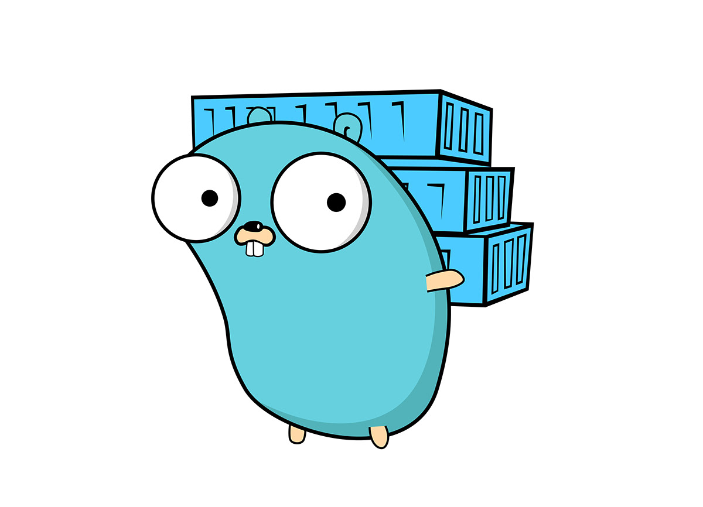

# 设计模式（Golang实现）

## 创建型模式

| 模式 | 描述 | 状态 |
| -- | -- | -- |
| 单例模式（Singleton） | 确保类只有一个实例，提供全局访问点，适用于配置管理等场景。 | ✅ |
| 简单工厂（Simple Factory） | 工厂类根据参数创建对象，集中管理创建逻辑，但扩展性较差。 | ✅ |
| 工厂方法（Factory Method） | 定义创建接口，子类实现对象创建，解耦创建与使用，易扩展。 | ✅ |
| 抽象工厂（Abstract Factory） | 创建一组相关对象接口，统一产品族，适合跨平台组件场景。 | ✅ |
| 原型模式（Prototype） | 通过复制已有对象创建新对象，适合复杂对象创建或需要克隆的场景。 | ✅ |

## 结构型模式

## 行为型模式
